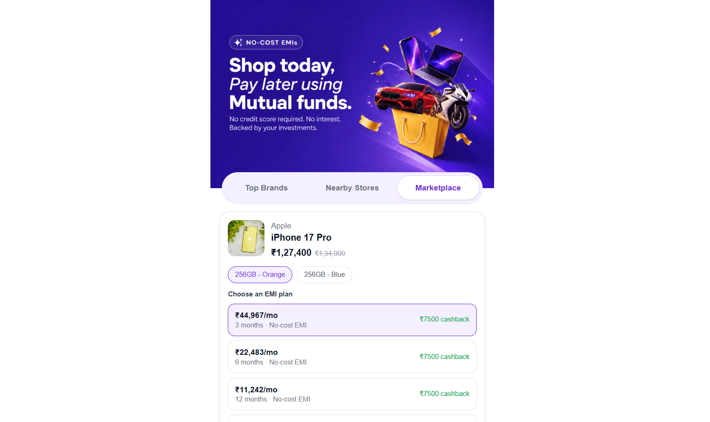
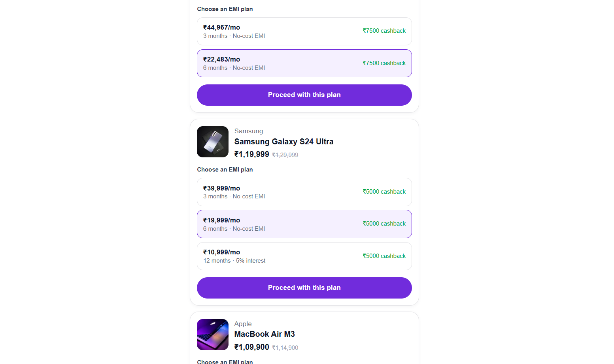

# Shop Marketplace

A Marketplace tab built inside a Shop

## Live Demo

[Live Website](https://shop-marketplace-flax.vercel.app/shop)

## Preview





## Tech Stack

- Next.js 15
- TypeScript
- Tailwind CSS

## Structure

```
app/
  shop/page.tsx                          → /shop route
  api/marketplace/products/route.ts      → mock API endpoint
components/
  shop/
    ShopContent.tsx           → tab switcher (Top Brands / Nearby Stores / Marketplace)
    TopBrandsPanel.tsx        → blank
    NearbyStoresPanel.tsx     → blank
    marketplace/
      MarketplacePanel.tsx    → fetches products, handles loading/error states
      ProductCard.tsx         → product display, variant + EMI plan selection, CTA
types/marketplace.ts          → Product / ProductVariant / EMIPlan types
lib/mock-marketplace-data.ts  → mock product data
```

## Data handling

Product/EMI data is **not hardcoded into UI components**. It's served from a mock API route (`/api/marketplace/products`) with a simulated network delay, and fetched client-side via `useEffect` + `fetch`. This mirrors how a real backend integration would work. Swapping the mock route for a real API later requires no changes to the UI components.

## States handled

- **Loading** — skeleton cards matching loading-skeleton pattern
- **Error** — a fallback card if the fetch fails
- **Image fallback** — if a product image fails to load, a "No image" placeholder is shown instead of a broken image icon
- **Empty EMI selection** — the CTA button is disabled until the user picks an EMI plan for that product's currently selected variant

## Running locally

```bash
npm install
npm run dev
```

Visit `http://localhost:3000/shop`.